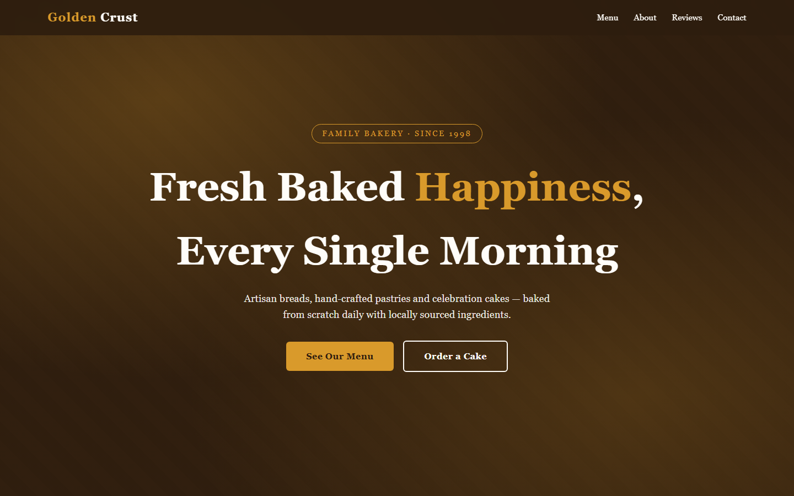
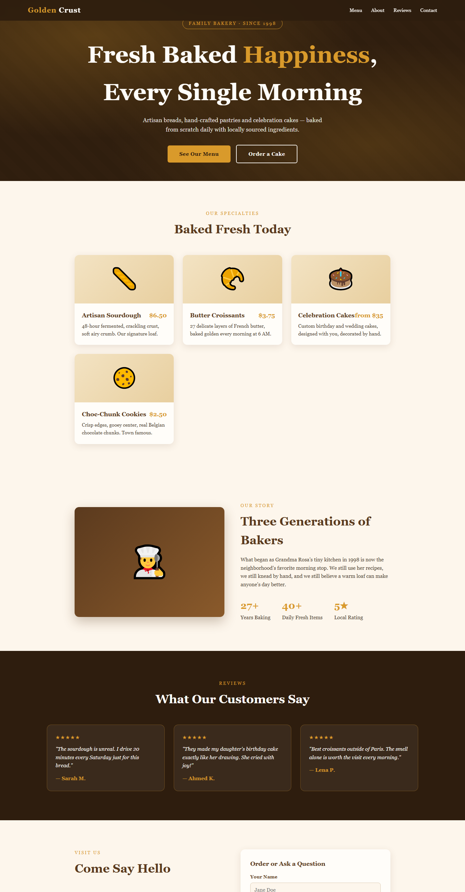
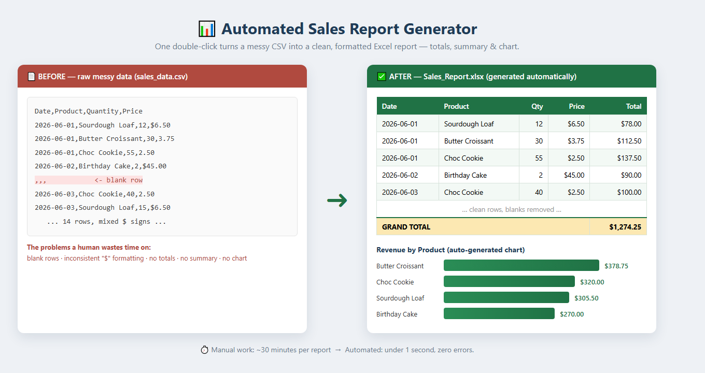

# Freelance Portfolio — Tughral Khattak

Real, working samples of the services I build for small businesses: **modern websites, Python automation, and AI chatbots.** Everything here runs and is free to inspect.

---

## 🥖 Demo 1 — Responsive Business Website
**Folder:** [`portfolio/bakery-website`](portfolio/bakery-website)

A complete, modern, mobile-responsive website for a bakery — built with clean hand-written HTML & CSS (no bloated page builders). Single file, fast loading.

**Features:** sticky navigation, full-screen hero, menu grid, story section with stats, customer reviews, working contact form, fully responsive down to mobile.



<details><summary>📄 See the full page</summary>



</details>

👉 Open `index.html` in any browser to view it.

---

## 📊 Demo 2 — Python Automation: Sales Report Generator
**Folder:** [`portfolio/automation-demo`](portfolio/automation-demo)

Turns a messy CSV of raw sales rows into a **clean, formatted Excel report** with totals, a per-product summary, and a bar chart — in one double-click. The kind of repetitive manual work I automate for clients.



**Handles real-world mess:** skips blank rows, strips `$` signs, ignores bad numbers, then outputs a styled multi-sheet `.xlsx` with a chart.

```
python sales_report.py
# -> Sales_Report.xlsx  (14 rows, 4 products, $1,274.25 total)
```

---

## 🤖 Demo 3 — AI Chatbot
See my dedicated repo: **[local-ai-chatbot](https://github.com/tughralkhattak/local-ai-chatbot)** — a private, document-aware AI assistant that runs entirely on your own machine.

---

## 📬 Work with me
I build websites, automation scripts, and AI chatbots for small businesses.
- 💬 Message me through my **[GitHub profile](https://github.com/tughralkhattak)**.
- Available for freelance projects — fast delivery, clear communication.
